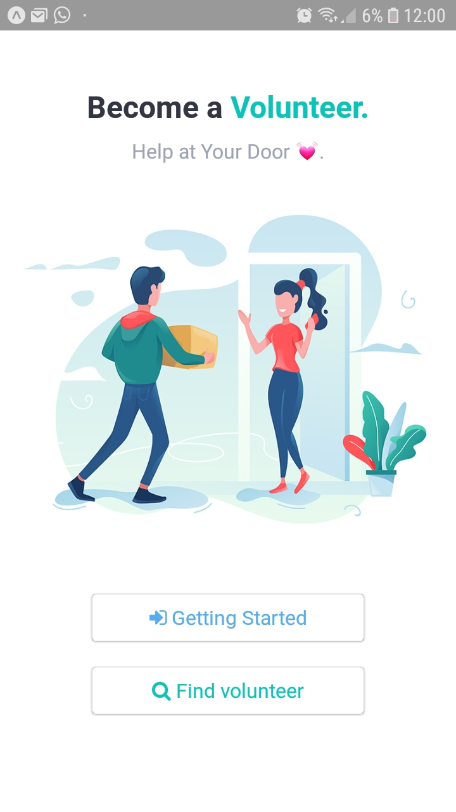
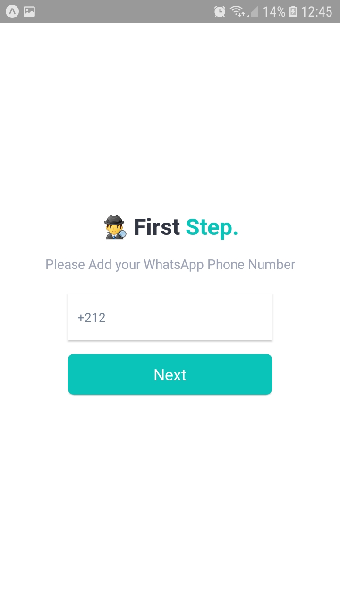

# Welcome to Jibli App 😷

✌️ We are so excited to have you. With your help, we can build out Jibli to be more stable and better serve our community.

 

    
     
    
    
    
     
      
      

  Created and maintained with ❤️ by  <a href="https://github.com/getspooky">getspooky</a>.

## Table of Contents

- [What is Jibli ?](#What-is-Jibli)
- [Table of Contents](#Table-of-Contents)
- [Screenshot](#Screenshot)
- [Quick Overview](#Quick-Overview)
- [Contributing](#Contributing)
- [Requirements](#Requirements)
- [Platform Support](#Platform-Support)
- [Security Vulnerabilities](#Security-Vulnerabilities)
- [Changelog](#changelog)
- [How Can I Help?](#How-Can-I-Help?)
- [Core team](#Core-team)
- [Support the Team](#Support-the-Team)
- [License](#license)

## What is Jibli ?

For some reason, despite lockdowns, shutdowns, and a fair few nervous breakdowns, there are still people not taking the coronavirus pandemic seriously. Coronavirus spreads easily and asymptomatically, and the only way to slow it down so that intensive care units don't get flooded with more severe cases than they can care for is for everyone to stay in their damn house as much as possible.
For this, the application was designed in order to provide free delivery platform 😷😷😷

# Screenshot

   
   
   
   

## Quick Overview

Installation is done using the npm install command:

### Installing Expo CLI

We recommend installing Expo CLI globally

<pre>
 npm install -g expo-cli
</pre>

### Clonning the repo from github

<pre>
 git clone https://github.com/getspooky/Jibli.git 
</pre>

### Openning the application in Android Or IOS Operation System

<pre>
// for android
npm run android
// for ios 
npm run ios
</pre>

## Contributing

We encourage you to contribute to Jibli! Please check out the [Contributing](/Contributing.md) to Jibli guide for guidelines about how to proceed.

## Requirements

Jibli has a few requirements you should be aware of before installing:

- Node.js >= 8.0.0
- npm >= 6.10.3
- git(cvs)

## Platform Support

Jibli supports reasonably different Platforms

- Android
- IOS
- Web

## Security Vulnerabilities

If you discover a security vulnerability within Jibli, please send an e-mail to `Yasser Ameur El Idrissi` via getspookydev@gmail.com . All security vulnerabilities will be promptly addressed.

## Changelog

Please see [CHANGELOG](CHANGELOG.md) for more information what has changed recently.

## How Can I Help?

- Contribute to the core repository.
- Share Jibli philosophy
- Make a video that you explain Jibli.
- Follow our Jibli repository.

## Core team

-[@getspooky](https://github.com/getspooky)

## Support the Team

Through [donations](https://www.patreon.com/user?u=9251520), you allow Jibli to thrive. Your donations directly support office hours, continued enhancements, and most importantly, great application !

## License

Please see [License File](LICENSE.md) for more information.

 

   Stay At Home ❤️

